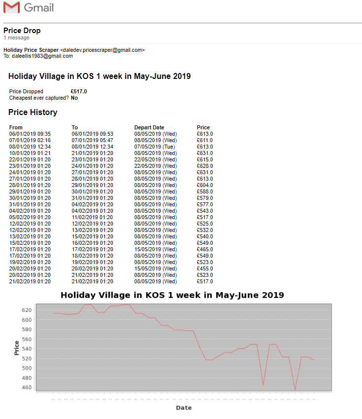

# Holiday Price Scraper

## About
The holiday price scraper app is a Spring Boot application which runs as a FAAS.
The service scraps holiday prices for stored search criteria and alerts receipts to price changes.

---
###### _Example Email_

---

### Supported websites

The following websites can be scrapped for prices

* First Choice
* TUI _< Not Yet Supported, Planned in Next Revision >_

### Supported Environments

* Standalone Spring Boot App
* AMS Lambda
* Azure Functions  _< Not Yet Supported, Planned in Next Revision >_

## Running the application

Regardless of the run environment, all deployments require the following settings

`imgurClientId` and `imgurClientSecret` must be set as environment variables
```properties
imgurClientId=<your imgur client ID>
imgurClientSecret=<your imgur client secret>
```

### To run as a standalone application
When running standalone, the persistence of the criteria and search results are stored in the local filesystem,
there are several required properties needed to support this

```properties
mailserverUser=<your mail server username>
mailserverPassword=<your mail server password>
# local.storage.folder.path is optional, will default to OS's temporary folder path
local.storage.folder.path=<location where criteria and results will be persisted>
```

To run the application standalone, you must set the maven profile to `boot`

### To run as a AWS Lambda Function

To run as function in AWS lambda, you must select Java 8 as the "Function Code" runtime value, for the "Handler" values
you must set this to `com.daledev.holidaypricescrapper.function.PriceCheckAwsHandler`. The jar which you upload must be built with
the maven profile `aws`.
